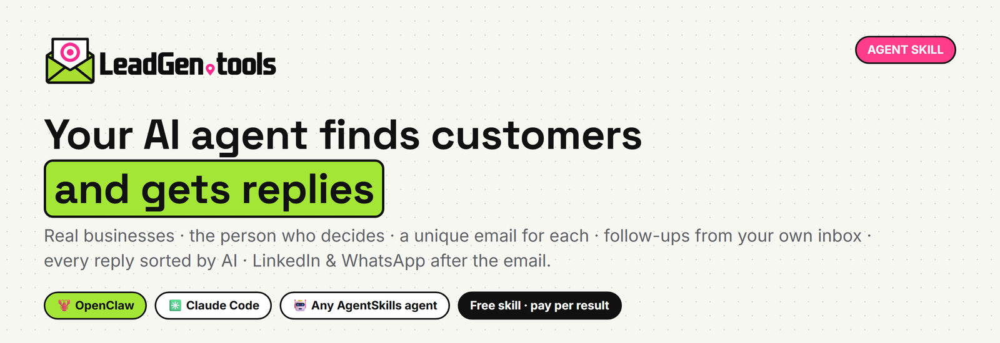
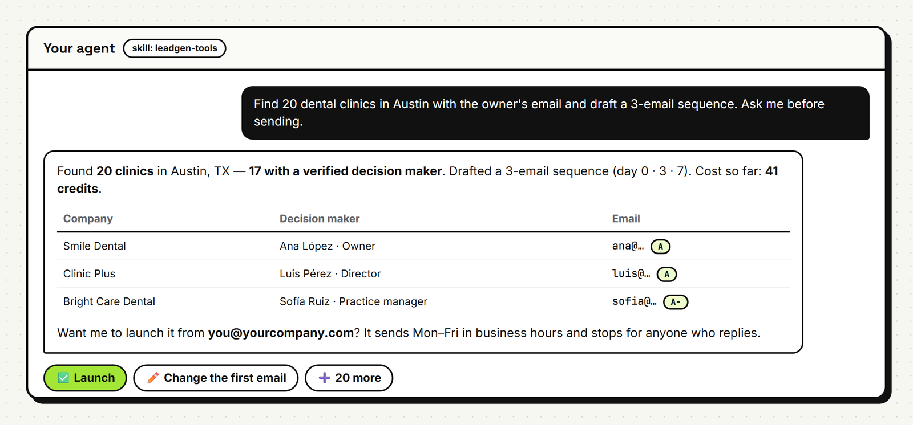
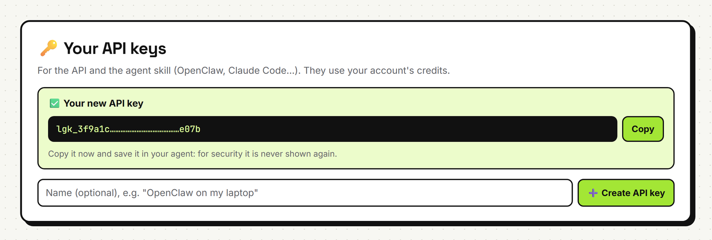
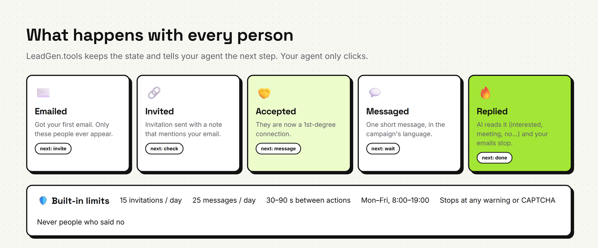

<p align="center">
  <a href="https://leadgen.tools"></a>
</p>

<p align="center">
  <a href="CHANGELOG.md"></a>
  <a href="LICENSE"></a>
  
  
  
  <a href="https://leadgen.tools/v2/api/v1/"></a>
</p>

# LeadGen.tools skill for AI agents

Give your AI agent the whole outbound pipeline in one skill. It finds **real businesses** in any niche and city
and the **person who decides** at each one, with a verified email. Then it writes **a different email for every
prospect** and sends them from **your own inbox**, with follow-ups that stop when someone answers. Every reply
is **sorted by AI**, so you only read the ones that matter. After the email, LinkedIn and WhatsApp are ready
too.

Works with [OpenClaw](https://openclaw.ai), Claude Code and any agent that reads `SKILL.md` files
([AgentSkills](https://agentskills.io) format).

<p align="center"></p>

## ✨ What your agent can do with it



Just ask, in plain words:

| You say | The agent does |
|---|---|
| *“Find 50 dental clinics in Austin with the owner's email.”* | Real businesses from maps data, crawls their websites, finds the decision maker with a verified email |
| *“Every Monday, find 40 new real estate agencies in Madrid, write the emails and ask me before sending.”* | A weekly routine that never contacts the same company twice |
| *“Who answered my campaigns? Draft replies for the interested ones.”* | Reads every reply already classified (interested · meeting · question · not interested · out of office…) |
| *“Here are 30 target accounts. Find the marketing head at each and start a 3-email sequence.”* | Account-based outreach with the right person at each company |
| *“Which plumbers are running Google ads in Miami this week? Contact them.”* | Companies spending on ads (they have budget) |
| *“Brief me on this company before my 3 pm call.”* | Website, emails, phones, socials and who's who |
| *“Do today's LinkedIn follow-up for my campaign.”* | Invitations with a note, one message to those who accept, replies back into the campaign, in your own browser, with safe limits |

Twelve ready-made automations: [`playbooks.md`](leadgen-tools/references/playbooks.md) · step-by-step recipes:
[`workflows.md`](leadgen-tools/references/workflows.md).

> 🎬 See how it works, with an example conversation: **https://leadgen.tools/v2/try/agents**

## 🚀 Get started in 3 steps

### 1. Install the skill

```bash
# OpenClaw, from GitHub
openclaw skills install git:LeadGenTools/leadgen-tools-skill@main
```

<details>
<summary>Other agents / manual install</summary>

Copy the `leadgen-tools` folder into your agent's skills folder:

| Agent | Folder |
|---|---|
| OpenClaw (all agents) | `~/.openclaw/skills/leadgen-tools` |
| OpenClaw (one workspace) | `<workspace>/skills/leadgen-tools` |
| Claude Code | `~/.claude/skills/leadgen-tools` or `<project>/.claude/skills/leadgen-tools` |
| Other AgentSkills agents | their skills directory |

```bash
git clone https://github.com/LeadGenTools/leadgen-tools-skill.git
cp -r leadgen-tools-skill/leadgen-tools ~/.claude/skills/leadgen-tools   # e.g. Claude Code
```

</details>

### 2. Create your API key in one click

Create a free account at **[leadgen.tools](https://leadgen.tools)**, then open
**[API & Agents → Create API key](https://leadgen.tools/v2/app/core.php?section=api&new=1)**.



The key starts with `lgk_` and is shown **once**, so copy it right away. You can revoke it and create another
whenever you want (up to 5 per account).

### 3. Give it to the skill

OpenClaw: `~/.openclaw/openclaw.json`

```json5
{
  skills: {
    entries: {
      "leadgen-tools": { enabled: true, apiKey: "lgk_your_key" }
    }
  }
}
```

Any other agent: environment variable

```bash
export LEADGEN_API_KEY="lgk_your_key"
```

Try it: ***“Use LeadGen.tools to find 10 coffee shops in Denver with emails.”***

> To **send** campaigns from LeadGen.tools, connect at least one Gmail or SMTP inbox in the app (**My email**).
> You don't need one if you only want data, or if you send with your own tool.

## 💼 LinkedIn & WhatsApp after the email



The API keeps track of each person, and your agent does the clicks **in your own signed-in browser**:

1. An invitation with a note that mentions your email.
2. One message once they accept.
3. Their reply goes back into the campaign. It is classified, and **the emails stop**.

Built-in limits (15 invitations and 25 messages a day, 30–90 s apart, weekdays) and stop rules come from the
API, so every agent follows the same rules. WhatsApp works the same way: decision makers' phones, whether they're
on WhatsApp, and a link that opens the chat with the message already typed. Step by step:
[the blog tutorial](https://leadgen.tools/blog/claude-in-chrome-linkedin-follow-up/).

> LinkedIn doesn't allow automated activity on its site. Keep volume low, use only your own account, and stop at
> any warning. The skill tells the agent to do exactly that.

## 🪙 Pricing

**The skill is free.** API calls use your LeadGen.tools credits, and every response says exactly what it cost.

| Action | Credits |
|---|---|
| Companies (a page of ~20) | 2 |
| An email found on their website | 1 |
| A verified email | 2 |
| A decision maker with a verified email | 2 |
| A decision maker without an email (name & title only) | 1 |
| Contacting a prospect (all follow-ups included) | 1 |
| Verifying emails, storing prospects, managing campaigns, LinkedIn & WhatsApp follow-up | free |

Details: [API docs → credits & pricing](https://leadgen.tools/v2/api/v1/#pricing).

## 📦 What's inside

```
leadgen-tools/
├── SKILL.md                 what the agent reads first: capabilities, rules, pipeline, credits, errors
├── references/
│   ├── api.md               every endpoint, parameter and response field
│   ├── workflows.md         step-by-step recipes with exact calls (incl. the LinkedIn daily routine)
│   └── playbooks.md         12 business automations
└── scripts/
    └── leadgen.sh           tiny curl client (keeps your key out of the process list)
```

Requirements: `curl` and `bash` (macOS, Linux, or Git Bash on Windows). The agent can also call the API with
its own HTTP tools.

## 🔒 Security & control

- The key only goes to `leadgen.tools` over HTTPS. The script passes it to curl through stdin, so it never
  shows up in the process list or your shell history.
- The agent asks before spending a lot of credits, and it **never launches a campaign or sends email without
  your approval** (unless you set a standing rule with a cap).
- Every email goes out from your own inbox, Mon–Fri in business hours, with daily limits. Anyone who opts out
  is never contacted again.
- Leaked key? Revoke it on **API & Agents** and create a new one in one click.

## 🔗 Links

- Website: <https://leadgen.tools>
- API documentation: <https://leadgen.tools/v2/api/v1/>
- Create an API key: <https://leadgen.tools/v2/app/core.php?section=api&new=1>
- Blog: <https://leadgen.tools/blog/>
- Changelog: [CHANGELOG.md](CHANGELOG.md)

## License

MIT, see [LICENSE](LICENSE). LeadGen.tools is a Cerebro Digital company.
